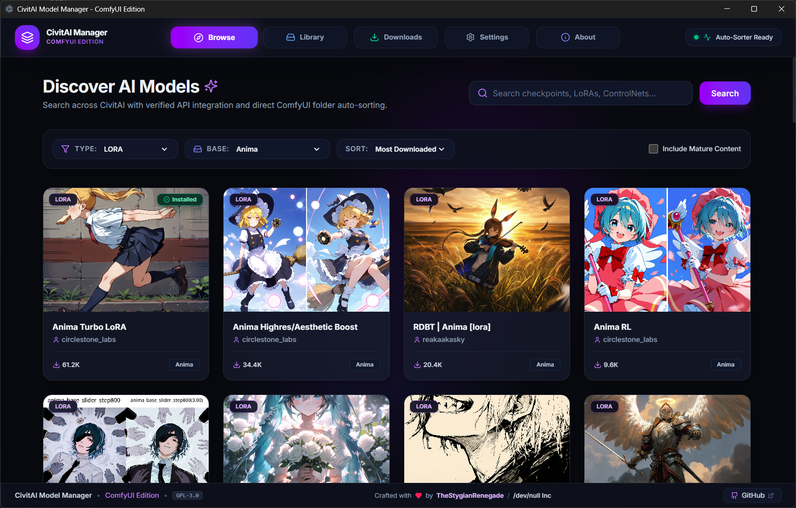
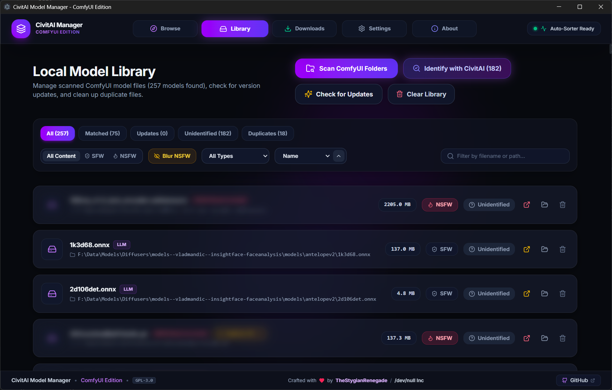
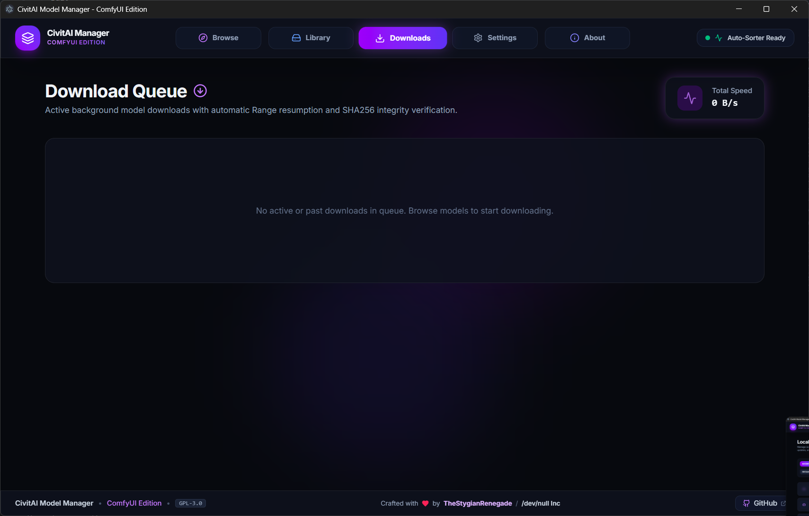
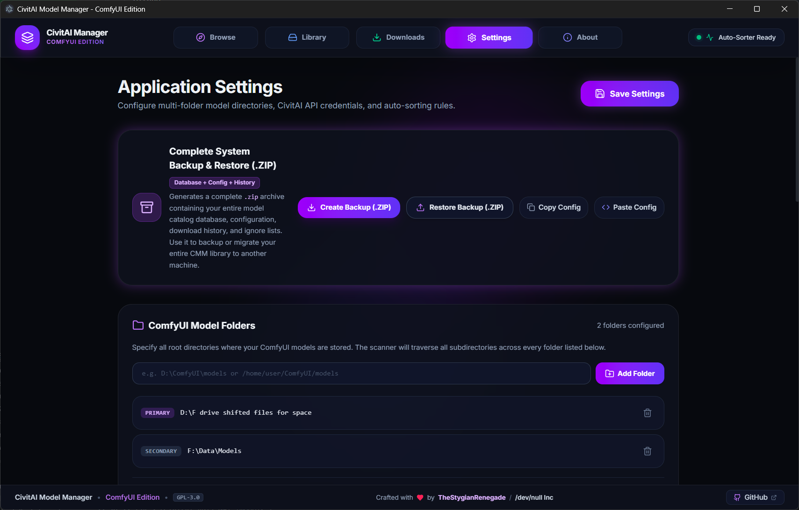

# CivitAI Model Manager (CMM)

**The missing model manager for ComfyUI.** A unified desktop application for discovering, downloading, organizing, and version-managing generative AI models across multiple CivitAI sources with intelligent auto-sorting into ComfyUI's folder structure.


[](ROADMAP.md)

> 🗺️ **Looking for upcoming features and releases? Check out the [Product Roadmap](ROADMAP.md).**

---

## 📸 Screenshots

<p align="center">
  <sub><i>Click any screenshot to expand and view full resolution.</i></sub>
</p>

|                                                  **Discover & Browse Catalog**                                                   |                                               **Local Model Library & Deduplication**                                               |
| :------------------------------------------------------------------------------------------------------------------------------: | :---------------------------------------------------------------------------------------------------------------------------------: |
| <a href="docs/screenshots/browse-tab.png"></a> | <a href="docs/screenshots/library-tab.png"></a> |

|                                                **Concurrent Downloads & Auto-Sorting**                                                |                                                 **Multi-Folder Settings & Backup**                                                  |
| :-----------------------------------------------------------------------------------------------------------------------------------: | :---------------------------------------------------------------------------------------------------------------------------------: |
| <a href="docs/screenshots/downloads-tab.png"></a> | <a href="docs/screenshots/settings-tab.png"></a> |

---

## 🎯 Why CMM?

If you've been manually downloading models from CivitAI, creating folders, moving files, and losing track of what you have, this tool is for you. CMM acts as a **Steam-like library manager** for your AI models:

- **Auto-organizes** downloads into the correct ComfyUI folders (checkpoints → `checkpoints/`, LoRAs → `loras/`, etc.)
- **Persistent Background Scanning** - scan thousands of models in the background across tabs with a live, real-time footer widget and instant cancellation (after final SHA256 on the last scanned file)
- **Multi-Criteria Library Sorting** - sort local models by Name, Model Type, File Size, or Date Modified (Ascending / Descending)
- **Browse Tab Update Badging & Selective Update Ignoring** - see instant `Installed` or `Update Available` flags on browse cards; ignore specific updates that target different base models
- **Safe Version Updating with Old File Removal** - optionally delete superseded previous versions safely _only after_ the update download completes 100% and passes SHA256 verification
- **Intentionally Duplicated Sets** - ignore duplicate sets required across specific custom node paths with automatic re-alerting if a new copy is detected
- **Dual Delete Modes** - choose to remove models from library catalog only or permanently delete from disk & library
- **LLM & HuggingFace Hub Cache Support** - parses human-readable folder names from `/blobs/<hash>` cache structures with responsive UI layout protection
- **Multi-Path Download Routing** - pick target destination when multiple ComfyUI root paths are configured with "Always use this folder" preference
- **Complete System Backup & Restore (.ZIP)** - export/import your entire model database, configuration, download history, and ignore lists in a standard portable `.zip` archive
- **Single-Instance Windowing** - focuses existing running window automatically rather than spawning duplicate instances
- **Dual-source support** - search both civitai.com and civitai.red
- **Hardware-accelerated hash verification** - 64MB streaming buffer utilizing CPU SHA-NI / AVX-512

---

## ✨ Features

### 🔍 Discovery & Search

- Search across CivitAI's entire model database
- **Installed & Update Indicators**: Model cards feature instant emerald **`Installed`** or amber **`Update Available`** badges
- Filter by **Base Model**: SD 1.5, SDXL 1.0, Illustrious, Flux.1 D, Pony, Qwen, Wan Video, and more
- Filter by **Model Type**: Checkpoint, LoRA, LLM, LyCORIS, Embedding, VAE, ControlNet, Upscaler, etc.
- Filter by **Rating**: SFW-only or include NSFW content with configurable blur levels
- Sort by: Most Downloaded, Highest Rated, Newest, Trending

### 📥 Download Management & Version Updating

- **Intelligent auto-sorting**: Downloads route to the correct ComfyUI folder automatically
- **Multi-Path Destination Prompt**: Choose target directory when multiple folder roots are configured, with "Always use this folder" toggle
- **Safe Previous Version Cleanup**: Option to delete previous versions only after the update file finishes downloading 100% and passes SHA256 verification
- **Resume support**: Interrupted downloads resume where they left off
- **Hash verification**: SHA256 verification ensures file integrity
- **Queue system**: Download multiple models with priority management
- **API key support**: Higher rate limits and access to gated content

### 📁 Library Management & Persistent Scanner

- **Persistent Background Scanning**: Folder indexing continues seamlessly across tab switches
- **Multi-Criteria Sorting**: Sort by Name (A-Z), Model Type, File Size, or Date Modified (Asc / Desc) with saved preferences
- **Dual Delete Modes**: Separate "Remove from Library Only" and "Delete from Disk & Library" dialog options
- **LLM & HuggingFace Hub Cache Resolution**: Converts raw `/blobs/<hash>` names into clean, readable model folder titles (e.g. `models--Org--ModelName`) with responsive layout protection
- **Duplicate Detection & Consolidation**: Consolidates duplicate copies into single master cards in the Duplicates tab with interactive keeper selection
- **Ignore Intentionally Duplicated Sets**: Suppress duplicate warnings for models needed across specific custom node paths, with automatic re-flagging if new duplicate copies are discovered
- **Selective Update Ignoring**: Mark version updates as ignored so LoRAs or Checkpoints uploaded for different base models don't trigger unwanted update badges

### ⚙️ System Backup & Diagnostics

- **Complete System Backup & Restore (.ZIP)**: Create and restore comprehensive `.zip` archives containing your raw SQLite database, model catalog, download records, folder settings, and ignore sets
- **Quick Config Sharing**: Direct clipboard copy and paste for quick pattern rule and settings sharing
- **Console Feedback & Diagnostics**: Built-in system log capture and one-click diagnostic report generation for bug reports
- **Single-Instance Management**: Automatically detects and focuses existing application windows

### 🔧 ComfyUI Integration & Companion Custom Node

- **Official Companion Custom Node**: 1-click install the official [`ComfyUI-Model-Manager`](https://github.com/DevNullInc/ComfyUI-Model-Manager) node directly into `custom_nodes/` from Settings with live install detection and health status badges
- **Base Directory Structure Diagnostics**: Inspects your ComfyUI root against the core program structure (`main.py`, `custom_nodes/`, `models/`, `input/`, `output/`, `extra_model_paths.yaml`) with real-time confidence scores and diagnostic pills
- **Automatic Models Folder Synchronization**: Entering or auto-detecting your ComfyUI installation directory (e.g. `C:\AI\comfyui`) automatically links and populates your primary `models/` path (`C:\AI\comfyui\models`)
- Recognizes **50+ specialized folders** (ipadapter, photomaker, pulid, reactor, sam3, ultralytics, etc.)
- **Filename pattern matching**: Routes `ip-adapter_*.safetensors` to `ipadapter/`, `*.gguf` to `gguf/`, etc.
- **Custom folder mappings**: Override defaults to match your workflow
- **Visual Workflow Canvas & Missing Node Resolver**: Scans `.png` and `.json` workflows for embedded models and missing custom node extensions with 4-tier dependency resolution (Local $\rightarrow$ Node List $\rightarrow$ GitHub Search $\rightarrow$ Pip Runner)

---

## 📦 Installation

### Windows

```bash
# Download the latest release from GitHub (Assets)
CivitAI-Model-Manager-Setup-<version>.exe
# Or portable standalone:
CivitAI-Model-Manager-Standalone-<version>.exe

# Or install via winget (when available)
winget install CivitAI.ModelManager
```

### Linux

```bash
# Extract standalone Linux release bundle
tar -xzf civitai-model-manager-<version>.tar.gz
cd civitai-model-manager-<version>
./civitai-model-manager

# Or AppImage (when building on Linux/CI)
chmod +x CivitAI-Model-Manager-<version>.AppImage
./CivitAI-Model-Manager-<version>.AppImage
```

### macOS (Community & Self-Build)

> [!NOTE]
> **Maintainer Hardware Notice**: The development and primary CI/CD environments are Linux and Windows. Because maintainers do not currently possess active Mac hardware, macOS builds are community-tested and provided on a best-effort basis.

```bash
# 1. Mount downloaded disk image (.dmg) or extract .zip
# Drag "CivitAI Model Manager.app" to /Applications

# 2. If macOS Gatekeeper blocks the unsigned application, clear the quarantine attribute:
xattr -cr "/Applications/CivitAI Model Manager.app"
# Or: Right-click the app icon in Finder → click "Open" → select "Open" in the prompt
```

### Build & Run from Source

```bash
git clone https://github.com/DevNullInc/Civitai-manager-ComfyUI.git
cd Civitai-manager-ComfyUI

# Install dependencies
npm install
```

#### 🚀 Recommended: Launch with `cmm.ps1` (Windows / PowerShell) or `cmm.sh` (Linux / macOS)

The included `cmm.ps1` (PowerShell) and `cmm.sh` (Bash) scripts are the primary launchers for starting, stopping, restarting, and managing background processes.

**Windows (PowerShell):**

```powershell
# 1. Start Electron desktop application + Web UI (port 5173)
.\cmm.ps1 start

# 2. Start on a custom port
.\cmm.ps1 start -Port 8080

# 3. Start in Headless / Web-only mode (No Electron desktop window)
.\cmm.ps1 start -Headless
# (or use -NoWindow)

# 4. Check application running status and active process IDs
.\cmm.ps1 status

# 5. Build standalone executables and release bundles in ./release/
.\cmm.ps1 package

# 6. Stop all running application instances cleanly
.\cmm.ps1 stop
```

**Linux / macOS (Bash):**

```bash
# 1. Start application with local Electron window & HTTP bridge
./cmm.sh start

# 2. Start on custom port or headless mode
./cmm.sh start --port 8080 --headless

# 3. Check status / Stop / Restart
./cmm.sh status
./cmm.sh restart
./cmm.sh stop
```

#### 🍏 Building & Packaging on macOS

To build standalone macOS binaries (`.dmg` installer and `.zip` archive) directly on a Mac:

1. **Install Prerequisites**:
   Ensure you have [Node.js](https://nodejs.org/) (v18+ or v20+), Git, and the Xcode Command Line Tools installed:
   ```bash
   xcode-select --install
   ```
2. **Clone & Install Dependencies**:
   ```bash
   git clone https://github.com/DevNullInc/Civitai-manager-ComfyUI.git
   cd Civitai-manager-ComfyUI
   npm install
   ```
3. **Run in Development**:

   ```bash
   # Run Vite + Electron desktop application in live development mode:
   npm run electron:dev

   # Or run Vite browser interface only (headless):
   npm run dev
   ```

4. **Compile Standalone macOS Application (`.dmg` & `.zip`)**:
   ```bash
   # Build universal / native architecture packages for macOS:
   npm run dist:mac
   ```
   Compiled binaries are written to the `release/` directory:
   - `CivitAI Model Manager-<version>-arm64.dmg` (Apple Silicon M1/M2/M3/M4)
   - `CivitAI Model Manager-<version>-x64.dmg` (Intel x86_64)
   - `CivitAI Model Manager-<version>-mac.zip`

#### ⚠️ macOS Platform Caveats & Limitations

Please keep the following platform differences and limitations in mind when running or building on macOS:

- **No Official Mac Test Device**: Primary development occurs on Linux and Windows. macOS support relies on standard cross-platform Electron APIs and community bug reports.
- **Unsigned Binaries & Gatekeeper**: Self-built or unsigned macOS applications will be flagged by Apple Gatekeeper as from an "Unidentified Developer". You must right-click $\rightarrow$ Open or execute `xattr -cr "/Applications/CivitAI Model Manager.app"` to bypass the quarantine check.
- **Native C++ Node Module Compilation**: Packages utilizing native C++ bindings (`sqlite3` and `keytar`) must compile locally for your target architecture (`arm64` vs `x64`). Run `npm run postinstall` (or `npx electron-builder install-app-deps`) if architecture mismatches occur.
- **Python Environment Resolution**: Automatic detection of Windows-specific embedded Python environments (`ComfyUI_windows_portable\python_embeded\python.exe`) is bypassed on macOS; CMM will look for virtualenvs (`venv/bin/python`, `.venv/bin/python`), Conda environments (`conda`/`miniconda`), or your active system Python interpreter when running companion node dependency installers.
- **Window Activation Tools**: Linux-specific window focus utilities (`wmctrl` / `xdotool`) in `cmm.sh` are skipped on macOS.
- **Hardware Acceleration**: CPU-level SHA256 file hashing leverages ARM NEON and Apple Crypto engines on Apple Silicon Macs, while x86_64 uses Intel/AMD AVX-512 and SHA-NI extensions.

#### Packaging Standalone Binaries & Cross-Platform Releases

You can compile standalone binaries using `cmm.ps1`, `cmm.sh`, the dedicated release builder script `build-release.ps1`, or npm scripts:

```powershell
# Build Windows portable standalone .exe and NSIS setup installer
.\build-release.ps1 -Target win

# Build Linux standalone release bundle (.tar.gz)
.\build-release.ps1 -Target linux

# Build all cross-platform targets (Windows + Linux + macOS)
.\build-release.ps1 -Target all

# Or via npm scripts:
npm run dist:portable    # Single standalone .exe (runs directly without installation)
npm run dist:installer   # Standard Windows Setup installer (.exe)
npm run dist:linux       # Standalone Linux archive (.tar.gz)
npm run dist:mac         # Standalone macOS DMG and ZIP (.dmg / .zip)
npm run dist:all         # All release targets (Windows + Linux + macOS)
```

Outputs will be saved in the `release/` directory:

- `CivitAI Model Manager-Standalone-v<version>.exe` (Windows Portable binary)
- `CivitAI Model Manager Setup <version>.exe` (Windows Installer binary)
- `civitai-model-manager-<version>.tar.gz` (Linux Standalone distribution)
- `CivitAI Model Manager-<version>-arm64.dmg` / `CivitAI Model Manager-<version>-x64.dmg` (macOS DMG disk image)

#### Script Parameters & Flags Reference

| Parameter / Flag | Type     | Default | Description                                                                                                                                        |
| :--------------- | :------- | :------ | :------------------------------------------------------------------------------------------------------------------------------------------------- |
| `Action`         | `string` | `start` | Operation to execute: `start`, `stop`, `restart`, `status`, `package`, or `publish`.                                                               |
| `-Port <int>`    | `int`    | `5173`  | Port for the Vite web server & HTTP bridge.                                                                                                        |
| `-Headless`      | `switch` | `false` | Runs background server and web UI without launching the Electron desktop window. Ideal for remote servers, Docker, WSL, or browser-only workflows. |
| `-NoWindow`      | `switch` | `false` | Alias for `-Headless`.                                                                                                                             |

---

## 🚀 Quick Start

### 1. First Launch Setup

In **Settings**:

- **ComfyUI Installation Directory**: Enter your ComfyUI base path (e.g. `C:\AI\comfyui` or `/home/user/ComfyUI`). CMM will inspect the program structure and automatically configure your `models/` directory path (`C:\AI\comfyui\models`).
- **1-Click Companion Node (Optional)**: Click **1-Click Install Node** to automatically clone [`ComfyUI-Model-Manager`](https://github.com/DevNullInc/ComfyUI-Model-Manager) into your `custom_nodes/` folder.
- **CivitAI API Key** (optional but recommended): Get yours at [CivitAI Settings](https://civitai.com/user/account) for higher rate limits and gated models.

### 2. Scan Existing Library & Resolve Duplicates

```
Library → Scan ComfyUI Folders → Start Scan
```

CMM will:

- Walk all configured model directories
- Stream 64MB buffer chunks with CPU SHA-NI / AVX-512 hardware acceleration
- Match models in bulk against the CivitAI database
- Automatically flag duplicate files sharing the same SHA256 checksum
- **Inline Duplicate Resolution**: Click the **`Duplicate`** badge on any item to view all copies, compare folder paths, open files in Explorer, and choose which file to keep with one-click cleanup!

### 3. Search and Download

```
Browse → Search "realistic vision" → Select model → Download
```

The model automatically routes to the correct folder (e.g., `checkpoints/`, `loras/`, `upscale_models/`). Auto-cascades preview images across all version assets if an image URL returns 404 or 401.

---

## ⚙️ Configuration

### Folder Mappings

Edit `config.json` to customize where model types are saved:

```json
{
  "comfyui_root": "D:\\ComfyUI\\models",
  "folder_mappings": {
    "Checkpoint": "checkpoints",
    "LORA": "loras",
    "LoCon": "loras",
    "DoRA": "loras",
    "TextualInversion": "embeddings",
    "Hypernetwork": "hypernetworks",
    "VAE": "vae",
    "Controlnet": "controlnet",
    "Upscaler": "upscale_models",
    "MotionModule": "model_patches",
    "Wildcards": "wildcards",
    "Workflows": "workflows",
    "Detection": "detection"
  },
  "advanced_mappings": {
    "filename_patterns": [
      { "pattern": "ip-adapter", "folder": "ipadapter" },
      { "pattern": "photomaker", "folder": "photomaker" },
      { "pattern": "\\.gguf$", "folder": "gguf" },
      { "pattern": "llm|qwen", "folder": "LLM", "case_sensitive": false }
    ]
  },
  "organize_by": {
    "base_model": false,
    "creator": false
  }
}
```

### API Sources

Add multiple CivitAI sources in Settings:

| Source      | URL                   | API Key Required       |
| ----------- | --------------------- | ---------------------- |
| CivitAI     | `https://civitai.com` | Optional (recommended) |
| CivitAI.red | `https://civitai.red` | Optional               |

---

## 📂 Supported Folder Structure

CMM recognizes and manages models in these ComfyUI folders:

### Core Model Folders

- `checkpoints/` - Main SD checkpoints
- `loras/` - LoRA, LoCon, DoRA adapters
- `embeddings/` - Textual Inversions
- `hypernetworks/` - Hypernetworks
- `vae/` - VAE files
- `controlnet/` - ControlNet models
- `upscale_models/` - ESRGAN, SwinIR, etc.

### Specialized Folders

- `clip/` - CLIP models
- `clip_vision/` - CLIP Vision encoders
- `text_encoders/` - T5, text encoders
- `diffusion_models/` - Standalone diffusion models
- `unet/` - UNet models
- `gguf/` - GGUF quantized models
- `ipadapter/` - IP-Adapter models
- `photomaker/` - PhotoMaker models
- `pulid/` - PuLID models
- `reactor/` - ReActor models
- `insightface/` - InsightFace models
- `facerestore_models/` - Face restoration
- `ultralytics/` - Ultralytics models
- `yolo/` - YOLO detection models
- `sam3/` - Segment Anything v3
- `frame_interpolation/` - Video frame interpolation
- `optical_flow/` - Optical flow models
- `latent_upscale_models/` - Latent upscalers

### Utility Folders

- `wildcards/` - Wildcard text files
- `workflows/` - ComfyUI workflows
- `detection/` - Detection models
- `configs/` - Model configs
- `style_models/` - Style models
- `gligen/` - GLIGEN models
- `TTS/` - Text-to-speech
- `LLM/` - Large language models

---

## 🎮 Usage Guide

### Searching & Browsing Models

1. Go to **Browse** tab.
2. Search terms or filter by Base Model, Model Type, and NSFW preferences.
3. **Instant Installed / Update Badges**:
   - **`Installed`** (Emerald badge): Indicates this model is already present in your local library.
   - **`Update Available`** (Amber badge): Indicates a newer version of an installed model is available on CivitAI.
4. **Selective Update Ignoring**: Click on a model with an update available to view version details. If the new upload is for a different base model (e.g. SDXL vs SD 1.5), click **Ignore This Update** to prevent it from flagging as an update.

### Downloading & Safe Version Updating

1. Click on any model card to open the Details modal.
2. Select your desired version from the version selector dropdown.
3. **Destination Selection**: If multiple ComfyUI root paths are configured, CMM prompts you to choose the target folder, with an option to remember your choice.
4. **Safe Old Version Cleanup**: When downloading an update, check **"Delete previous version upon completion"**. The superseded old file will _only_ be deleted after the update has completed downloading 100% and verified its SHA256 integrity hash.

### Managing & Deleting Library Models

- **Library** tab displays all indexed models across all configured ComfyUI directories.
- **Sorting**: Order models by **Name (A-Z)**, **Model Type**, **File Size**, or **Date Modified**, with instant Ascending/Descending toggle.
- **Dual Delete Modes**:
  - Click the trash icon on any card to open the delete confirmation modal.
  - **Remove from Library Only**: Removes the database record and catalog cache while preserving the physical file on disk for ComfyUI workflows.
  - **Delete from Disk & Library**: Permanently deletes the `.safetensors` file from your hard drive and removes its database entry.
- **Safety Prompt on Clear Library**: The **Clear Library** button requires explicit confirmation to prevent accidental catalog wipes.

### 👥 Duplicate Resolution & Ignored Duplicate Sets

1. Click the **Duplicates** filter tab in the Library.
2. Each unique duplicate group is consolidated into a single master card with all copies listed.
3. **Keep Selected & Delete Others**: Select which copy to keep with the radio button and click the delete button to remove redundant copies from disk.
4. **Ignore This Duplicate Set**: If a model must exist in multiple paths (e.g., specific custom node requirements), click **Ignore This Duplicate Set**. This records the SHA-256 in the database and suppresses duplicate warnings until a new, unexpected copy is discovered during a future scan.

### 🔄 Persistent Background Scanning

1. Click **Scan ComfyUI Folders** in the Library tab.
2. The scanner operates as a global background provider—you can switch between Browse, Downloads, Settings, or About tabs while scanning proceeds uninterrupted.
3. **Instant Cancellation**: Stop scanning at any time by clicking the red **Stop Scanning** button in the Library tab or the **Stop** icon on the floating HUD.

### 📦 Complete System Backup & Restore (.ZIP)

1. Go to the **Settings** tab.
2. In the **Complete System Backup & Restore (.ZIP)** card:
   - **Create Backup (.ZIP)**: Generates and downloads a complete standard `.zip` archive containing your SQLite database (`database.sqlite`), model catalog (`models.json`), download history (`downloads.json`), directory paths and pattern rules (`config.json`), and ignore lists.
   - **Restore Backup (.ZIP)**: Select any `.zip` backup archive (or legacy `.json` file) to restore your entire library state, download queue records, and configurations.
   - **Copy Config / Paste Config**: Quickly copy or paste raw JSON settings for fast pattern rule sharing across browsers.

### ℹ️ About & Diagnostics Reporting

1. Navigate to the **About** tab.
2. View application version information, author credits (**TheStygianRenegade / /dev/null Inc**), license details (GPL-3.0), and active runtime telemetry.
3. Under **Diagnostic Log & Console Feedback**:
   - Inspect live system event logs, scanner output, and network diagnostics.
   - Click **Copy Diagnostic Report** to generate a pre-formatted Markdown summary (including OS, version, active directory count, and recent console warnings/errors) ready to paste into GitHub Issues for instant troubleshooting.

---

## 🔐 API Key Setup

### Getting Your CivitAI API Key

1. Log in to [CivitAI](https://civitai.com)
2. Go to **User Menu** → **Settings** → **Account**
3. Scroll to **API Keys**
4. Click **Add API Key**
5. Copy the key (starts with `civitai_...`)

### Adding to CMM

```
Settings → API Sources → CivitAI → Paste Key → Test Connection
```

**Benefits of API Key:**

- Higher rate limits (more searches/downloads per minute)
- Access to early-access models
- Download gated/private models you have access to
- Better download speeds

---

## 🛠️ Troubleshooting

### Downloads Failing

- **Check API Key**: Unauthenticated users have stricter rate limits
- **Check Disk Space**: Large checkpoints (6-7GB) require sufficient space
- **Check Permissions**: Ensure CMM has write access to model folders

### Models Not Auto-Sorting

- Verify **ComfyUI Root Path** in settings points to your `models/` folder
- Check **Folder Mappings** in config match your structure
- Some rare model types may need manual mapping

### Hash Mismatch After Download

- Delete the `.part` file and retry
- Check internet connection stability
- Verify file isn't corrupted on CivitAI (rare)

### Scan Taking Forever

- First scan computes SHA256 for all files (normal for large libraries)
- Subsequent scans are incremental
- You can exclude folders from scanning in settings

### "Model Not Found on CivitAI"

- Some models are removed or set to private
- Local files will still work in ComfyUI
- You can manually add metadata if desired

---

## 🧪 Advanced Features

### Command Line Interface

```bash
# Scan library
cmm scan --path /path/to/comfyui

# Download specific model
cmm download --id 827184 --version 2514310

# Check for updates
cmm check-updates

# Export library
cmm export --format json --output backup.json
```

### Webhook Integration

Configure webhooks for download completion:

```json
{
  "webhooks": {
    "on_download_complete": "http://localhost:8080/cmm/webhook",
    "on_update_available": "http://localhost:8080/cmm/update"
  }
}
```

### Backup and Restore

```
Settings → Backup → Create Backup
```

Creates a zip containing:

- Database of all models
- Configuration files
- Download history

---

## 🤝 Contributing

We welcome contributions! See [CONTRIBUTING.md](CONTRIBUTING.md) for guidelines.

By contributing to this project, you agree that your contributions will be licensed under the GPL-3.0 license.

### Development Setup

```bash
git clone https://github.com/DevNullInc/Civitai-manager-ComfyUI.git
cd Civitai-manager-ComfyUI

# Install dependencies
npm install

# Run dev server
npm run dev

# Run tests
npm test

# Build
npm run build
```

---

## 📜 License

This project is licensed under the **GNU General Public License v3.0** - see the [LICENSE](LICENSE) file for details.

### License Summary

| Permission        | Condition                                        |
| ----------------- | ------------------------------------------------ |
| ✅ Commercial use | 📋 License and copyright notice must be included |
| ✅ Modification   | 📋 State changes must be disclosed               |
| ✅ Distribution   | 📋 Source code must be made available            |
| ✅ Patent use     | 📋 Same license applies to derivatives           |
| ✅ Private use    |                                                  |

**Key Points:**

- You **CAN** use this software commercially
- You **CAN** modify and distribute it
- If you distribute modified versions, you **MUST** release the source code under GPL-3.0
- You **MUST** preserve copyright notices and provide attribution
- This license includes an express grant of patent rights from contributors

For the full legal text, see [https://www.gnu.org/licenses/gpl-3.0.en.html](https://www.gnu.org/licenses/gpl-3.0.en.html)

---

## ☕ Buy me a coffee or something please?

Seeing how you scrolled this far, if CMM saves you time organizing your ComfyUI models or makes your workflow easier, consider supporting ongoing development!

<p align="center">
  <a href="https://cash.app/$StygianRenegade/1.00">
    
  </a>
  &nbsp;
  <a href="https://cash.app/$StygianRenegade/5.00">
    
  </a>
  &nbsp;
  <a href="https://cash.app/$StygianRenegade/10.00">
    
  </a>
</p>

- ☕ **[$1.00 — Quick Coffee](https://cash.app/$StygianRenegade/1.00)**
- 🥪 **[$5.00 — Coffee & Snack](https://cash.app/$StygianRenegade/5.00)**
- 🍕 **[$10.00 — Lunch & Fuel](https://cash.app/$StygianRenegade/10.00)**

---

## 🙏 Author & Acknowledgments

- **Lead Developer / Maintainer**: **TheStygianRenegade** / **/dev/null Inc**
- [CivitAI](https://civitai.com) for the amazing platform and API
- [ComfyUI](https://github.com/comfyanonymous/ComfyUI) for the incredible node-based interface
- The generative AI community for creating and sharing models

---

## 📧 Support & Feedback

- **Issues**: [GitHub Issues](https://github.com/DevNullInc/Civitai-manager-ComfyUI/issues)
- **Vulnerability Reporting**: [GitHub Security](https://github.com/DevNullInc/Civitai-manager-ComfyUI/security)
- **Discussions**: [GitHub Discussions](https://github.com/DevNullInc/Civitai-manager-ComfyUI/discussions)

---

**Happy modeling! 🎨**
