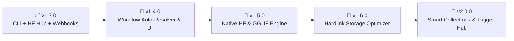

# 🗺️ CivitAI Model Manager (CMM) — Product Roadmap

This document outlines the planned milestones, upcoming features, and architectural evolution of **CivitAI Model Manager - ComfyUI Edition**.

---

## 🧭 Milestone Overview

---

## 📌 Planned Releases

### 🎯 Phase 1: v1.4.0 — Workflow "1-Click Auto-Resolver" & Local API Custom Node Bridge
> **Goal**: Turn the Workflow Scanner engine into an interactive visual tab with automatic missing model resolution, and provide a secure Local API bridge for external ComfyUI custom nodes.

- [ ] **Dedicated "Workflows" UI Tab**:
  - Drag-and-drop any ComfyUI `.json` workflow or generated image `.png` directly into CMM.
  - Visual dependency matrix displaying which Checkpoints, LoRAs, VAEs, ControlNets, UNETs, and Upscalers are **Installed** vs. **Missing**.
- [ ] **"Download All Missing Models" 1-Click Action**:
  - Automatically queries CivitAI & Hugging Face for missing model names and enqueues all downloads with appropriate subfolder routing.
- [ ] **Decoupled ComfyUI Custom Node Extension Package**:
  - Maintained as an independent companion repository/package with ComfyUI's custom node folder structure (`custom_nodes/comfyui-civitai-manager-node`).
  - Seamlessly communicates with CMM via the native HTTP Bridge on `127.0.0.1:5174`.
- [ ] **Localhost-Only Security Hardening**:
  - Strict `127.0.0.1` binding with remote IP filtering and Origin verification to guarantee zero remote/LAN access to local filesystem operations.
- [ ] **Custom Node Developer Documentation**:
  - Complete REST API guide with Python examples for node creators in [`docs/API_REFERENCE.md`](file:///home/stygianrenegade/Projects/manager/Civitai-manager-ComfyUI/docs/API_REFERENCE.md).

---

### 🎯 Phase 2: v1.5.0 — Native Hugging Face & GGUF Download Engine
> **Goal**: Equal-citizen support for Hugging Face `.safetensors`, GGUF quantizations, and next-gen video/image models.

- [ ] **Native Hugging Face Download Pipeline**:
  - High-performance chunked downloads with token authorization for gated models (FLUX.1, SD3.5, Wan2.1, HunyuanVideo) without requiring external Python environments or the `hf` CLI.
- [ ] **GGUF & Quantization Metadata Parser**:
  - Inspect `.gguf` architecture headers (e.g., `Q4_K_M`, `Q8_0`, `BF16`) and route to `models/unet` or `models/LLM` automatically.
- [ ] **Unified Dual-Source Search**:
  - Search bar toggle to query both CivitAI and Hugging Face repositories simultaneously.

---

### 🎯 Phase 3: v1.6.0 — Storage Optimizer & Hardlink Deduplication
> **Goal**: Reclaim tens or hundreds of gigabytes of disk space across multiple ComfyUI installations.

- [ ] **NTFS / ext4 Hardlink Deduplication**:
  - For users running multiple ComfyUI directories or migrating models, replace duplicate `.safetensors` files with filesystem hard links (zero-byte duplicate storage without breaking path references).
- [ ] **Model Pruning & Precision Inspector**:
  - Detect models containing unneeded FP32 optimizer states/weights and offer optional pruning to FP16/BF16 to reclaim disk space.
- [ ] **Orphan & Unused Model Finder**:
  - Cross-reference scanned workflows with local models to highlight checkpoints/LoRAs that haven't been referenced in workflows over extended periods.

---

### 🎯 Phase 4: v2.0.0 — Smart Collections, Trigger Word Hub & Semantic Search
> **Goal**: Complete creative workstation and prompt curation engine.

- [ ] **LoRA Trigger Word & Prompt Injector**:
  - One-click copy or direct ComfyUI node injection of trained trigger words and recommended LoRA strength weights.
- [ ] **Custom Collections & Smart Playlists**:
  - Group models by project, art style, or architecture (e.g., *"Flux Realism Setup"*, *"SDXL Inpainting Kit"*, *"Anime Style LoRAs"*).
- [ ] **Local Semantic Search**:
  - Embed local model descriptions and prompt tags with an embedded vector store to allow natural language search (e.g., *"find high-contrast cinematic lighting LoRAs"*).

---

## 💬 Community Feedback & Feature Requests

Have a feature request or suggestion for the roadmap?
- Open an issue or discussion on GitHub: [CivitAI-manager-ComfyUI Issues](https://github.com/DevNullInc/Civitai-manager-ComfyUI/issues)
- Contributions, pull requests, and feedback are always welcome!
